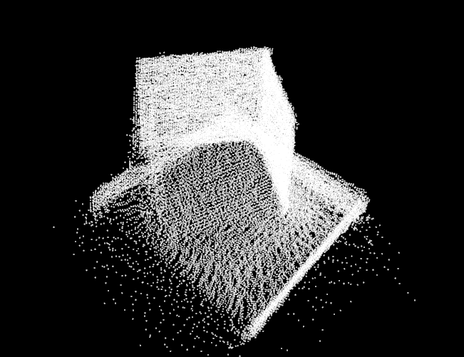

# CPPND: Capstone Project

# Project Description
This is the Capstone Project of
[Udacity C++ Nanodegree Program](https://www.udacity.com/course/c-plus-plus-nanodegree--nd213).
This project provides four applications:

## KinectViewer
KinectViewer is a simple application which uses [libfreenect2]() to connect to a Kinect V2,
process the depth capture of it and produce a real world coordinate point cloud out of it using [PCL]().

## KinectCapture
KinectCapture is the same as KinectViewer, but additionally is able to capture point cloud frames from
the Kinect by pressing 't' and save it to the custom `.frame` file format.

## FileViewer
FileViewer can be used to look at all the taken frames from `KinectCapture` by pressing 'p' to switch to
the next frame.

## Align
Align is the core application of this project. Align uses [PCL]() and an algorithm called
[Super4PCS](https://github.com/nmellado/Super4PCS) to stitch together different `.frames` taken
from different angles and re-produce the object visible in the center of all of them by finding out
the offset transformations.

`doc/real1.jpeg` and `doc/real2.jpeg` show two real world images of the captured scene of the
example data provided in this repo. `doc/result1.png`, `doc/result2.png` and `doc/result3.png`
show the point cloud created from the example data and re-aligned by Align.

# Setup

## Requirements
- Ubuntu 16.04 or higher
- GCC 7.2.0
- cmake
- [PCL](http://www.pointclouds.org/)
    - `sudo add-apt-repository ppa:v-launchpad-jochen-sprickerhof-de/pcl`
    - `sudo apt-get update`
    - `sudo apt-get install libpcl-all`
- [Super4PCS](https://github.com/nmellado/Super4PCS)
    - Download sources
    - Compile using regular cmake and make commands
    - Install by using `make install`
- Optional (requires a Kinect V2): [libfreenect2](https://github.com/OpenKinect/libfreenect2)
    - Follow the steps at `https://github.com/OpenKinect/libfreenect2/blob/master/README.md#linux`.
    
## Compile
When all the requirements are installed, you can run `mkdir build && cd build` and run
`cmake -DKINECT=OFF -Dfreenect2_DIR={where_you_installed_freenect}freenect2/lib/cmake/freenect2 -DSuper4PCS_DIR=/usr/local/lib/cmake/ ..`.

**NOTE: `-DKINECT=TRUE -Dfreenect2_DIR` is not required if you do not own a Kinect V2.**

After that you can run the applications.

## Run
You can run `./CppND_Capstone_Kinect_Viewer` if you have a Kinect V2 connected to your PC to see the
real world coordinate point cloud of the live depth picture.

`./CppND_Capstone_Capture` can be used to take `.frames` and save them to the current folder to be
late used by Align. This also requires a Kinect V2 connected to your PC. **Make sure to remove
all `.frames` from current folder before that.**

Using `./CppND_Capstone_File_Viewer` you can check out the taken `.frames` by Capture. If you are not
able to run Capture before, you can just run it with the bundled example frames of this repo.

Finally, using `./CppND_Capstone_Align` you can run the stitching of all frames in the current folder.
There will be a live view of the stitching/aligning process. When the alignment is done you can use
the window to check out the final point cloud from all perspectives.

# Used rubric points
The following rubric points from https://review.udacity.com/#!/rubrics/2533/view are used:

| Rubric                                                                                         	| Code Example                                           	|
|------------------------------------------------------------------------------------------------	|--------------------------------------------------------	|
| The project reads data from a file and process the data, or the program writes data to a file. 	| KinectDepthCapture.cpp:112, FrameUtils.h:21             	|
| The project uses Object Oriented Programming techniques.                                       	| All                                                    	|
| Classes abstract implementation details from their interfaces.                                 	| DepthCapture.h, FileDepthCapture.h, KinectDepthCapture.h 	|
| The project uses multithreading.                                                               	| KinectDepthCapture.cpp:32                              	|
| Classes encapsulate behavior.                                                                  	| All                                                    	|
